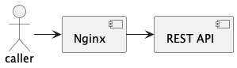
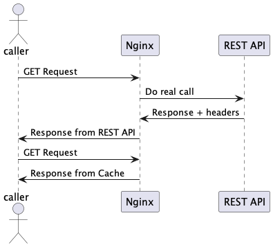

# SOLUTION CACHED REQUESTS MECHANISM

This repository shows the behaviour of some existing mechanisms to cache requests from a REST service.

As it's known, only those operations without any side effect and idempotent such as GET in a REST API is cacheable.

When a REST service is expose, it's usually hidden by an additional layer to control the access to it. There are several existing mechanisms base con response headers to notify the intermediate layer the request can be skipped because it's not going to change



The behaviour expected is



## Mechanisms checked

As far as I know, there are several mechanism based on headers:

* Expires
* Cache-Control
* eTag
* Last Modified

TBC

## How to start it locally?

Prerequisites

* Java 17
* Maven
* Docker

How to start it:

Step 1: Build project jar file

````shell
mvn clean package
````

Step 2: Launch compose

````shell
cd docker
docker-compose up
````

## How to check behaviour?

### Check Expires

Check it using the endpoint http://localhost/cached/expires

When the first request is launched the request hits the REST API.

The following requests launched don't hit the REST API. They are solved directly from the Nginx cache.

### Check Cache Control

Check it using the endpoint http://localhost/cached/cacheControl

When the first request is launched the request hits the REST API.

The following requests launched don't hit the REST API. They are solved directly from the Nginx cache.

### Check eTag

Check it using the endpoint http://localhost/cached/eTag

When the first request is launched the request hits the REST API.

The following requests launched hit the REST API. However, they are not solved with 200 status code. In this case the status code returned is 304, which means content not changed

### Check Last Modified

Check it using the endpoint http://localhost/cached/lastModified

When the first request is launched the request hits the REST API.

The following requests launched hit the REST API. However, they are not solved with 200 status code. In this case the status code returned is 304, which means content not changed